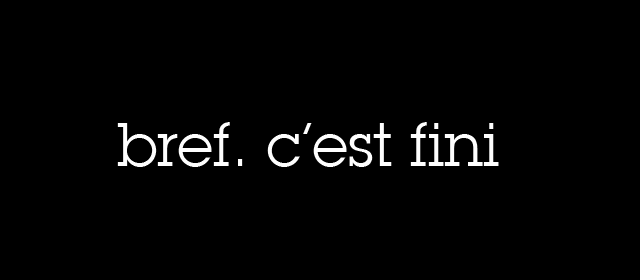

<style>

section {
  background-color: #fefefe;
  color: #333;
}

img[alt~="center"] {
  display: block;
  margin: 0 auto;
}

h1, h2 {
  text-align: center;
}

blockquote {
  background:rgb(251, 255, 0);
  border-left: 10px solidrgb(203, 15, 52);
  margin: 1.5em 10px;
  padding: 0.5em 10px;
}
blockquote:before{
  content: unset;
}
blockquote:after{
  content: unset;
}
</style>


# **JAVASCRIPT**

## **Quizz d'entrainement #2** 

## CDA 23016

---

> [Notes]
> liste des thèmes du questionnaire :

    - Syntaxe et Types de Données
    - Fonctions
    - Objets et Prototypes
    - Manipulation du DOM
    - Événements
    - Asynchrone (Promesses, Async/Await)
    - Modules et Import/Export
    - Gestion des Erreurs

> [IMPORTANT]
> plusieurs réponses sont possible sur certaines questions

---
## Syntaxe et Types de Données

**Question 1** : Comment déclarer et utiliser une variable de type string en JavaScript ?
- [ ] ``` let str = "Hello";```
- [ ] ``` const str = 'Hello';```
- [ ] ``` var str = "Hello";```
- [ ] ``` string str = "Hello";```

**Question 2** : Quelle est la différence entre == et === en JavaScript ?
- [ ] ``` == compare la valeur, === compare la valeur et le type.```
- [ ] ``` == compare le type, === compare la valeur.```
- [ ] ``` == et === sont identiques.```
- [ ] ``` == compare la valeur et le type, === compare seulement la valeur.```

---

**Question 3** : Comment vérifier si une variable est de type number en JavaScript ?
- [ ] ``` typeof variable === 'number'```
- [ ] ``` variable instanceof Number```
- [ ] ``` variable.isNumber()```
- [ ] ``` Number.isNumber(variable)```

**Question 4** : Quelle est la différence entre un array et un object en JavaScript ?
- [ ] ```Un array est une liste ordonnée, un object est une collection de paires clé-valeur.```
- [ ] ```Un array est une collection de paires clé-valeur, un object est une liste ordonnée.```
- [ ] ```Un array et un object sont identiques.```
- [ ] ```Un array est une fonction, un object est une liste.```

---

## Fonctions

**Question 5** : Comment déclarer une fonction en JavaScript ?
- [ ] ``` function myFunction() {}```
- [ ] ``` let myFunction = function() {}```
- [ ] ``` const myFunction = () => {}```
- [ ] ``` Toutes les réponses ci-dessus sont correctes.```

**Question 6** : Qu'est-ce qu'une fonction fléchée (arrow function) et comment l'utiliser ?
- [ ] ``` function arrowFunction() {}```
- [ ] ``` let arrowFunction = () => {}```
- [ ] ``` const arrowFunction = function() {}```
- [ ] ``` arrowFunction = () => {}```
---
**Question 7** : Comment passer des paramètres par défaut à une fonction en JavaScript ?
- [ ] ``` function myFunction(param = 'default') {}```
- [ ] ``` function myFunction(param = default) {}```
- [ ] ``` function myFunction(param = defaultValue) {}```
- [ ] ``` function myFunction(param = 'defaultValue') {}```
---
**Question 8** : Qu'est-ce qu'une fonction anonyme et comment l'utiliser ?
```js
- [ ] function() {}
```
```js
- [ ] let anonymousFunction = function() {}
``` 
```js 
- [ ] const anonymousFunction = () => {}
```
```js
- [ ] anonymousFunction = function() {}
```
---
**Question 9** : Comment utiliser la méthode apply pour appeler une fonction avec un contexte spécifique ?
```js
- [ ] myFunction.apply(context, [args])
```
```js
- [ ] myFunction.call(context, args)
``` 
```js 
- [ ] myFunction.bind(context, args)
```
```js
- [ ] myFunction.context(args)
```
---
## Objets et Prototypes

**Question 10** : Comment créer un objet en JavaScript ?
```js
- [ ] let obj = {}
```
```js
- [ ] const obj = new Object()
``` 
```js 
- [ ] var obj = Object.create()
```
```js
- [ ] Toutes les réponses ci-dessus sont correctes.
```
---
**Question 11** : Qu'est-ce qu'un prototype en JavaScript et comment l'utiliser ?
```js
- [ ] function MyObject() {} MyObject.prototype.method = function() {}
```
```js
- [ ] let MyObject = { prototype: { method: function() {} } }
``` 
```js 
- [ ] const MyObject = function() { this.prototype = { method: function() {} }}
```
```js
- [ ] var MyObject = { method: function() {} }
```
---
**Question 12** : Comment ajouter une méthode à un prototype d'objet ?
```js
- [ ] MyObject.prototype.newMethod = function() {}
```
```js
- [ ] MyObject.newMethod = function() {}
``` 
```js 
- [ ] MyObject.prototype = { newMethod: function() {} }
```
```js
- [ ] MyObject.newMethod = new Function()
```
---
**Question 13** : Quelle est la différence entre Object.create et l'opérateur new ?
- [ ] ``` Object.create crée un nouvel objet avec un prototype spécifié, new crée une instance d'une fonction constructeur.```
- [ ] ``` Object.create crée une instance d'une fonction constructeur, new crée un nouvel objet avec un prototype spécifié.```
- [ ] ``` Object.create et new sont identiques.```
- [ ] ``` Object.create est utilisé pour les objets, new est utilisé pour les fonctions.```
---
**Question 14** : Comment utiliser Object.assign pour fusionner des objets ?
```js
- [ ] Object.assign(target, source1, source2)
```
```js
- [ ] Object.merge(target, source1, source2)
``` 
```js 
- [ ] Object.combine(target, source1, source2)
```
```js
- [ ] Object.join(target, source1, source2)
```
---
## Manipulation du DOM

**Question 15** : Comment sélectionner un élément par son ID en JavaScript ?
```js
- [ ] document.getElementById('id')
```
```js
- [ ] document.querySelector('#id')
``` 
```js 
- [ ] document.getElementByID('id')
```
```js
- [ ] document.select('#id')
```
---
**Question 16** : Comment ajouter un nouvel élément au DOM ?
```js
- [ ] document.createElement('element')
```
```js
- [ ] document.append('element')
``` 
```js 
- [ ] document.addElement('element')
```
```js
- [ ] document.insert('element')
```
---
**Question 17** : Comment modifier le contenu textuel d'un élément ?
```js
- [ ] element.textContent = 'new text'
```
```js
- [ ] element.innerText = 'new text'
``` 
```js 
- [ ] element.setText('new text')
```
```js
- [ ] element.content = 'new text'
```
---
**Question 18** : Comment ajouter un écouteur d'événement à un élément ?
```js
- [ ] element.addEventListener('event', callback)
```
```js
- [ ] element.addListener('event', callback)
``` 
```js 
- [ ] element.on('event', callback)
```
```js
- [ ] element.listen('event', callback)
```
---
**Question 19** : Comment supprimer un élément du DOM ?
```js
- [ ] element.remove()
```
```js
- [ ] element.delete()
``` 
```js 
- [ ] element.parentNode.removeChild(element)
```
```js
- [ ] element.destroy()
```
---
## Événements

**Question 20** : Comment ajouter un écouteur d'événement à un bouton en JavaScript ?
```js
- [ ] button.addEventListener('click', callback)
```
```js
- [ ] button.onclick = callback
``` 
```js 
- [ ] button.click(callback)
```
```js
- [ ] Toutes les réponses ci-dessus sont correctes.
```
---
**Question 21** : Quelle est la différence entre addEventListener et onclick ?
- [ ] ``` addEventListener permet d'ajouter plusieurs écouteurs, onclick remplace l'écouteur existant.```
- [ ] ``` addEventListener remplace l'écouteur existant, onclick permet d'ajouter plusieurs écouteurs.```
- [ ] ``` addEventListener et onclick sont identiques.```
- [ ] ``` addEventListener est utilisé pour les événements, onclick est utilisé pour les fonctions.```
---
**Question 22** : Comment empêcher le comportement par défaut d'un événement ?
```js
- [ ] event.preventDefault()
```
```js
- [ ] event.stopDefault()
``` 
```js 
- [ ] event.prevent()
```
```js
- [ ] event.defaultPrevent()
```

**Question 23** : Comment arrêter la propagation d'un événement ?
```js
- [ ] event.stopPropagation()
```
```js
- [ ] event.stopBubbling()
``` 
```js 
- [ ] event.halt()
```
```js
- [ ] event.propagationStop()
```
---
**Question 24** : Comment déléguer des événements en JavaScript ?
```js
- [ ] parent.addEventListener('event', callback)
```
```js
- [ ] parent.delegate('event', callback)
``` 
```js 
- [ ] parent.on('event', callback)
```
```js
- [ ] parent.listen('event', callback)
```
---
## Asynchronisme (Promesses, Async/Await)

**Question 25** : Qu'est-ce qu'une promesse en JavaScript et comment l'utiliser ?
```js
- [ ] let promise = new Promise((resolve, reject) => {})
```
```js
- [ ] let promise = Promise.create((resolve, reject) => {})
``` 
```js 
- [ ] let promise = new Promise((resolve, reject))
```
```js
- [ ] let promise = Promise.new((resolve, reject) => {})
```
---
**Question 26** : Comment utiliser async et await pour gérer des opérations asynchrones ?
```js
- [ ] async function myFunction() { await promise; }
```
```js
- [ ] function myFunction() { async await promise; }
``` 
```js 
- [ ] async function myFunction() { return await promise; }
```
```js
- [ ] function myFunction() { return async await promise; }
```
---
**Question 27** : Quelle est la différence entre Promise.all et Promise.race ?
- [ ] ``` Promise.all attend que toutes les promesses soient résolues, Promise.race attend que la première promesse soit résolue.```
- [ ] ``` Promise.all attend que la première promesse soit résolue, Promise.race attend que toutes les promesses soient résolues.```
- [ ] ``` Promise.all et Promise.race sont identiques.```
- [ ] ``` Promise.all est utilisé pour les promesses, Promise.race est utilisé pour les fonctions.```
---
**Question 28** : Comment gérer les erreurs avec async et await ?
```js
- [ ] try { await promise; } catch (error) {}
```
```js
- [ ] async { await promise; } catch (error) {}
``` 
```js 
- [ ] try { return await promise; } catch (error) {}
```
```js
- [ ] async { return await promise; } catch (error) {}
```
---
**Question 29** : Comment créer une promesse qui se résout après un certain délai ?
```js
- [ ] new Promise(resolve => setTimeout(resolve, 1000))
```
```js
- [ ] Promise.delay(1000)
``` 
```js 
- [ ] new Promise(resolve => setTimeout(() => resolve(), 1000))
```
```js
- [ ] Promise.timeout(1000)
```
---
## Modules et Import/Export

**Question 30** : Comment exporter une fonction depuis un module en JavaScript ?
```js
- [ ] export function myFunction() {}
```
```js
- [ ] module.exports = myFunction
``` 
```js 
- [ ] export myFunction = function() {}
```
```js
- [ ] exports.myFunction = function() {}
```
---
**Question 31** : Comment importer une fonction depuis un module en JavaScript ?
```js
- [ ] import { myFunction } from 'module'
```
```js
- [ ] const myFunction = require('module')
``` 
```js 
- [ ] import myFunction from 'module'
```
```js
- [ ] let myFunction = import('module')
```
---
**Question 32** : Quelle est la différence entre export default et export nommé ?
- [ ] ``` export default exporte une seule valeur par défaut, export nommé exporte plusieurs valeurs.```
- [ ] ``` export default exporte plusieurs valeurs, export nommé exporte une seule valeur par défaut.```
- [ ] ``` export default et export nommé sont identiques.```
- [ ] ``` export default est utilisé pour les fonctions, export nommé est utilisé pour les variables.```
---
**Question 33** : Comment utiliser des modules ES6 dans un projet JavaScript ?
```js
- [ ] import 'module'
```
```js
- [ ] require('module')
``` 
```js 
- [ ] import * as module from 'module'
```
```js
- [ ] const module = import('module')
```

**Question 34** : Comment gérer les dépendances avec des modules en JavaScript ?
```js
- [ ] import { myFunction } from 'module'
```
```js
- [ ] const dependency = require('module')
``` 
```js 
- [ ] import dependency from 'module'
```
```js
- [ ] let dependency = import('module')
```
---
## Gestion des Erreurs

**Question 35** : Comment utiliser try, catch et finally pour gérer les erreurs en JavaScript ?
```js
- [ ] try { code } catch (error) { handleError } finally { cleanup }
```
```js
- [ ] try { code } catch (error) { handleError }
``` 
```js 
- [ ] try { code } finally { cleanup }
```
```js
- [ ] catch (error) { handleError } finally { cleanup }
```
**Question 36** : Qu'est-ce qu'une erreur de référence (ReferenceError) et comment la gérer ?
- [ ] ``` Une erreur qui se produit lorsqu'une variable n'est pas définie.```
- [ ] ``` Une erreur qui se produit lorsqu'une fonction n'est pas définie.```
- [ ] ``` Une erreur qui se produit lorsqu'un objet n'est pas défini.```
- [ ] ``` Une erreur qui se produit lorsqu'une méthode n'est pas définie.```
---
**Question 37** : Comment lancer une erreur personnalisée en JavaScript ?
```js
- [ ] throw new Error('message')
```
```js
- [ ] throw 'message'
``` 
```js 
- [ ] throw new Exception('message')
```
```js
- [ ] throw new CustomError('message')
```

**Question 38** : Comment gérer les erreurs asynchrones avec async et await ?
```js
- [ ] try { await promise; } catch (error) {}
```
```js
- [ ] async { await promise; } catch (error) {}
``` 
```js 
- [ ] try { return await promise; } catch (error) {}
```
```js
- [ ] async { return await promise; } catch (error) {}
```
---
**Question 39** : Comment utiliser console.error pour afficher des messages d'erreur ?
```js
- [ ] console.error('message')
```
```js
- [ ] console.log('error: message')
``` 
```js 
- [ ] console.warn('message')
```
```js
- [ ] console.debug('message')
```

**Question 40** : Comment utiliser les paramètres rest et spread en JavaScript ?
```js
- [ ] function myFunction(...args) {}
```
```js
- [ ] function myFunction(args...) {}
``` 
```js 
- [ ] function myFunction(args) {}
```
```js
- [ ] function myFunction(...rest) {}
```
---
**Question 41** : Qu'est-ce que le let et const et comment les utiliser ?
- [ ] ``` let est utilisé pour les variables mutables, const pour les variables immuables.```
- [ ] ``` let est utilisé pour les variables immuables, const pour les variables mutables.```
- [ ] ``` let et const sont identiques.```
- [ ] ``` let est utilisé pour les fonctions, const pour les objets.```
---
## Questions de Code

**Question 42** : Écrivez une fonction qui prend un tableau de nombres et retourne la somme de tous les éléments.
```js
function sumArray(arr) {
  // Votre code ici
}

console.log(sumArray([1, 2, 3, 4, 5])); // Doit afficher 15
```
---
**Question 43** : Écrivez une fonction fléchée qui prend deux nombres et retourne leur produit.
```js
const multiply = (a, b) => {
  // Votre code ici
};

console.log(multiply(3, 4)); // Doit afficher 12
```
---
**Question 44** : Écrivez une fonction qui utilise Object.assign pour fusionner deux objets.
```js
const obj1 = { a: 1, b: 2 };
const obj2 = { b: 3, c: 4 };

function mergeObjects(obj1, obj2) {
  // Votre code ici
}

console.log(mergeObjects(obj1, obj2)); // Doit afficher { a: 1, b: 3, c: 4 }
```
---
**Question 44** : Écrivez une fonction qui ajoute un écouteur d'événement à un bouton et affiche un message lorsque le bouton est cliqué.

function addClickListener(button) {
  // Votre code ici
}

const button = document.createElement('button');
button.textContent = 'Click me';
document.body.appendChild(button);
addClickListener(button);

**Question 44** : Écrivez une fonction qui utilise async et await pour attendre une seconde avant de retourner un message.

async function delayMessage() {
  // Votre code ici
}

delayMessage().then(message => console.log(message)); // Doit afficher "Message after 1 second" a


---


*Created with markdown & Marp by Jérôme BOEBION*  